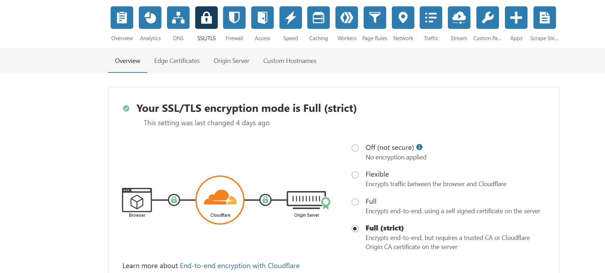
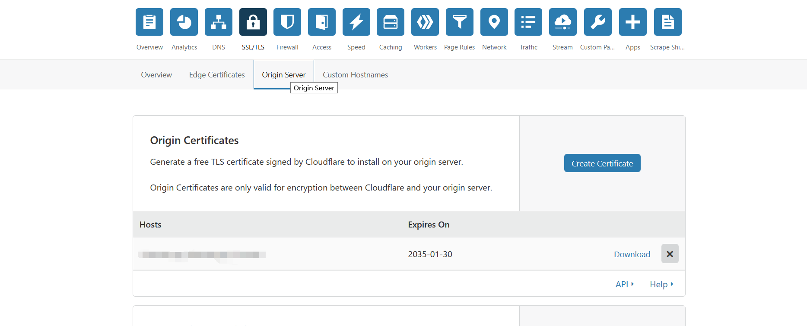

# v2ray-cdn-tls
使用v2ray+cdn+tls避免防火墙屏蔽
# v2ray-cdn-tls

去年为了使用ssr买的virmach的小鸡IP地址被咱防火墙屏蔽了，然后期间自己照着网上的教程，使用v2ray配合cloudflare的cdn和tls实现了拯救我小鸡的光荣使命。今年小鸡续费后，重装了系统，一切又恢复原样。于是前几天一直在琢磨，照着网络上的许多教程一个个尝试，也碰到了许多坑，最终又再次就回了我亲爱的小鸡。以下，详细记录下拯救过程，以免以后再次遇到同类问题，又浪费太多时间。

## 一. v2ray的配置


1. 安装v2ray，root用户下执行bash v2ray.sh，安装完成自动生成UUID和端口号，配置文件在/etc/v2ray/config.json文件中，可以用vim来修改其中的相关参数，重启服务即可；

2. 本机使用Ubuntu18.04的系统，自带防火墙为ufw, 当然也可以使用iptables或者firewalld，这里是ufw的设置并且假设v2ray监听tcp的1000端口：

   ~~~shell
   ufw allow 1000/tcp
   ufw enable
   systemctl restart ufw
   ~~~

   ~~~shell
   # v2ray的config文件配置如下:
   {
     "inbounds": [
       {
         "port": 1000,
         "listen":"127.0.0.1",
         "protocol": "vmess",
         "settings": {
           "clients": [
             {
               "id": "b831381d-6324-4d53-ad4f-8cda48b30811", #可修改
               "alterId": 64 
             }
           ]
         },
         "streamSettings": {
           "network": "ws", 
           "wsSettings": {
           "path": "/haoran" #自定义, 可修改
           }
         }
       }
     ],
     "outbounds": [
       {
         "protocol": "freedom",
         "settings": {}
       }
     ]
   }
   ~~~

   修改了config.json配置文件后, 如果小鸡没有被GFW屏蔽的话, 则可以使用v2ray客户端去测试下, 看是否能够成功连接。

## 二. 使用cloudflare的cdn服务

1. 首先去可以去[freenom](https://www.freenom.com/zh/index.html?lang=zh)官网注册一个免费域名，当然如果是从namesilo或者godaddy注册的收费域名也是可以的；

2. 访问[cloudflare](https://www.cloudflare.com/)的官网注册一个账号后，进入Home界面, 选择新建一个站点, 输入你之前注册过的域名, xxx.xx，然后选择个人免费的cdn服务, 接着cloudflare会给你它的两个名字服务器, 把相应的NS填入你的域名管理后台处，相当于让cloudflare接管了你的域名解析服务；

3. 耐心等待一会儿，如果cloudflare成功接管了你的域名解析服务后，会给你注册账号的邮箱发送一封成功的英文邮件，你就可以增加一条A记录，然后NAME和VALUE分别填上你的域名和IP地址，这里A记录中的域名是填三级域名，类似xxx.xxx.xxx，一般填入www， 即代表web应用，这样在后面才能将我们对于v2ray服务的使用伪装成websocket的访问；

4. 在SSL/TLS的Origin Server选项中创建一个证书，会有一个公钥和一个私钥，私钥需要复制保存一下, cloudflare只会存储公钥，当然你可以保存一份在本地, 比如公钥保存命名为v2ray.crt， 私钥保存命名为v2ray.key；

5. 在SSL/TLS的Overview选项中开启Full(strict)， 启用https, 针对你所伪装的web服务请求和接受的数据进行加密；

6. 关键图片两张。

   

   

## 三. 服务端安装NGINX做反向代理

1. 安装nginx服务器做反向代理，当然也可以使用Apache或者Caddy；

   ```shell
   # 在/etc/apt目录下下载nginx_signing.key
   wget http://nginx.org/keys/nginx_signing.key
   sudo apt-key add nginx_signing.key
   # 将以下代码追加到/etc/apt/sources.list文件末尾处
   # Ubuntu18.04代号为bionic, 其它版本Ubuntu版本可以更改为相应的代号
   deb http://nginx.org/packages/ubuntu/ bionic nginx 
   deb-src http://nginx.org/packages/ubuntu/ bionic nginx 
   apt-get update
   apt-get install nginx
   ```

2. 配置ufw防火墙

   ```she
   ufw allow 80/tcp
   ufw allow 443/tcp
   systemctl restart ufw
   ```

3. 在/etc/nginx/conf.d/下新建一个文件xxx.conf，填入下列信息:

   ```shell
   server {
     listen  443 ssl;
     ssl on;
     ssl_certificate       /etc/v2ray/v2ray.crt;
     ssl_certificate_key   /etc/v2ray/v2ray.key;
     ssl_protocols         TLSv1 TLSv1.1 TLSv1.2;
     ssl_ciphers           HIGH:!aNULL:!MD5;
     server_name           mydomain.me;
           location /haoran { # 与 V2Ray 配置中的 path 保持一致
           proxy_redirect off;
           proxy_pass http://127.0.0.1:1000; #假设WebSocket监听在环回地址的1000端口上
           proxy_http_version 1.1;
           proxy_set_header Upgrade $http_upgrade;
           proxy_set_header Connection "upgrade";
           proxy_set_header Host $http_host;
   
           # Show realip in v2ray access.log
           proxy_set_header X-Real-IP $remote_addr;
           proxy_set_header X-Forwarded-For $proxy_add_x_forwarded_for;
           }
   } 
   ```

4. 将本地的v2ray.crt和v2ray.key上传到对应的目录；

   ```shell
   scp v2ray.crt v2ray.key xxx@ip:/tmp
   mv v2ray.crt v2ray.key /etc/v2ray/
   ```

5. 重新启动nginx服务器。

   ~~~shell
   systemctl restart nginx
   ~~~

   

# 大功告成!!! ^_^

参考了以下教程:

https://toutyrater.github.io/advanced/wss_and_web.html
